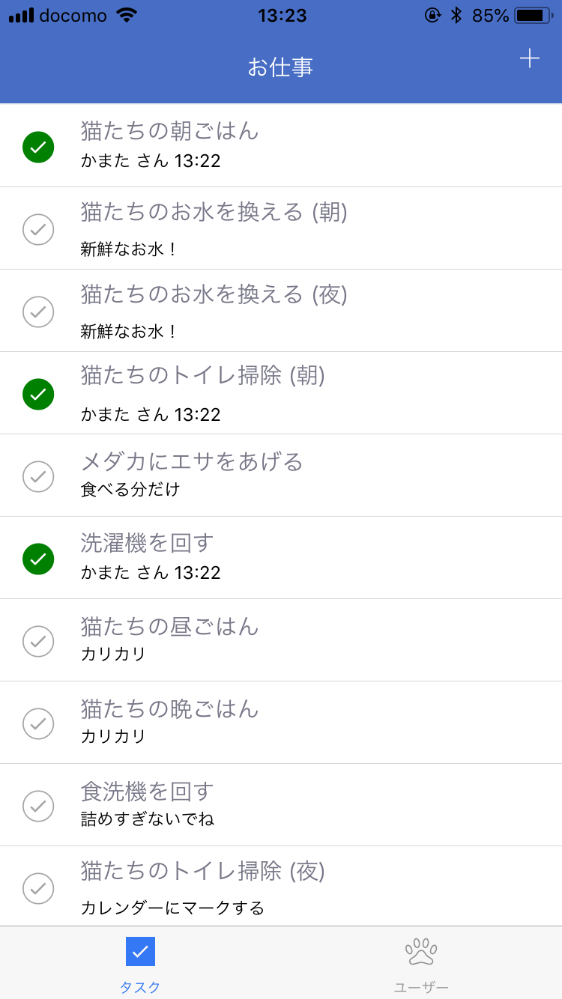

# OUCHI MESSENGER

[](https://travis-ci.org/kamataryo/ouchiMessenger)

Family task management application.




## Architecture

```
 [Amazon Cognito]───(3)───┐
        ^                    │
        │                    │
       (1)                   │
        │                    │
        v                    v
[iOS Application] <-(2)-> [AWS Lambda] <-(4)-> [Amazon DynamoDB]
        ^                     │
        │                     │
        │                     │
  [Amazon SNS]<─(5)───────┘
```

(1): Request authentication
(2): Request
(3): security control
(4): DB Access
(5): Request Push Notification

## Build and Deploy

### IAM

- create User with policy about SNS and DynamoDB Access describing below.

### SNS setting

- create Platform Application
- Note ARN

### Database setting

1.  Set up 1 DynamoDB table with key named `taskId`
2.  Note the table name, the access key id and the secret access key.

### batch setting

The batch reset task done/undone state.

1.  Create a lambda role with DynamoDB access.
2.  Create a lambda function with `/src/api/lambda.js` with environmental variables, `TABLE_NAME` and `REGION`.
3.  Set CloudWatch Events cron trigger for batch.

### app build (iOS only so far)

1.  `$ cp .env.sample.js .env.js`
2.  Edit the AWS credential with information above.
3.  Build and deploy from xcode.
